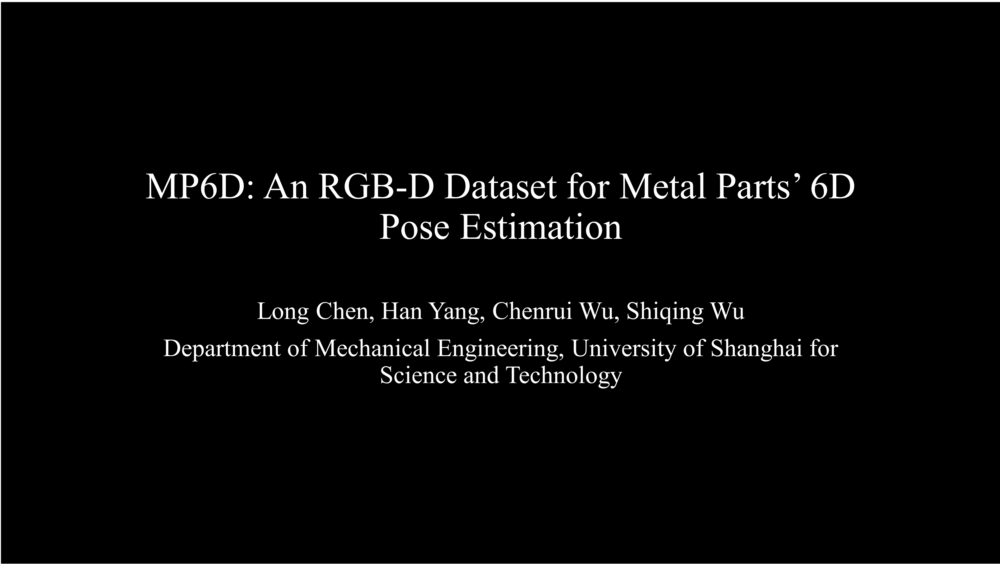
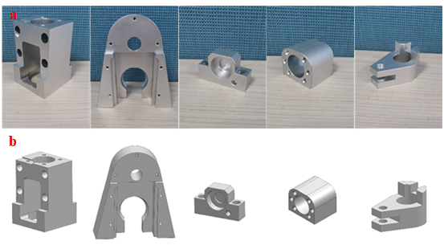
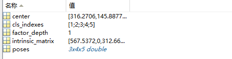

# MP6D: An RGB-D Dataset for Metal Parts’ 6D Pose Estimation
Information
===========
This is the MP6D dataset for 6D object pose estimation.
It contains 77 videos (20100 frames in total) of 20 metal parts in real scenes and 50000 synthetic images, each of which is partially affected by occlusion, illumination changes,and other factors. Due to the interference of the above factors, point cloud or depth information is often distorted or missing. The green shadow is shown in the following figure.

## About MP6D video
[Watch the video 

](https://youtu.be/_7i8U0sWFiI)

## Instance models

20 metal parts (15 parts fromaluminum oxide material and 5 parts from copper oxidesurface material) derived from the industrial environment. Metal parts are available in a range  of sizes from 17 to 125 mm. All of the objects are textureless, symmetric, of complex shape and with uniform color. 

## Real and rendered scenes

The dataset contains 11 real scenes and 50 synthesis scenes. Numbers 1-11 represent real-world acquisition scenes. Numbers 12-15 are some examples of synthetic images.

Basic Usage
===========

## The description of the directories in this package:

1. cameras. The camera parameters used to capture the videos. 
2. data. The 77 videos in the dataset.
3. data_syn1. 25,000 synthetic images of the 20 objects.
4. data_syn2. 25,000 synthetic images of the 20 objects.
5. models_cad. 20 CAD models of Ply format.

## The description of the Archive  in the directories:

The data of each frame is composed of RGB image, Depth image, Mask image, xxbox.txt and xxx.mat. where xxbox.txt represents the bounding box of the target in the figure. The content data of xxx.mat is as follows：  

1.center: 2D location of the projection of the 3D model origin in the image.      
2.cls_indexes: class labels of the objects.   
3.factor_depth: divde the depth image by this factor to get the actual depth vaule.  
4.intrinsic_matrix: camera intrinsics.  
5.poses: 6D poses of objects in the image.  

  

Download
===========

The data can be downloaded as a set of zip archives [here](https://koawere-my.sharepoint.com/:f:/g/personal/yhan_f_svip_gq/EvO12LCt82tInkOJV4ipyccBDun0bk_bDxM_rx5rMz982g?e=jrEYyL).

The bop data can be downloaded as a set of zip archives [here](https://koawere-my.sharepoint.com/personal/yhan_f_svip_gq/_layouts/15/onedrive.aspx?id=%2Fpersonal%2Fyhan%5Ff%5Fsvip%5Fgq%2FDocuments%2FBOP%5FMP6D&ga=1).

